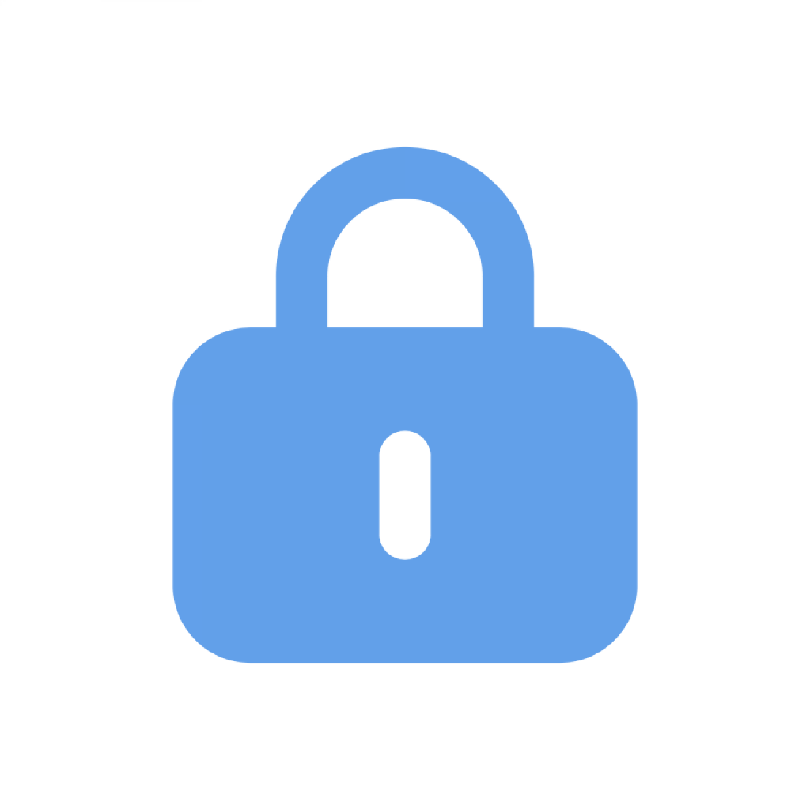

# Finalpass

**Created by: Ali Symeri (haha150)**

This project is a free password manager that also allows you to generate strong and secure passwords. It uses Chacha20poly1305 encryption for your privacy.

The app also has a desktop PC, Mac, Linux counterpart which also is free and open-source, [desktop version](https://github.com/haha150/finalpass).

See [Finalpass](https://haha150.github.io/finalpass) for more information.

## Feature request

If there is some feature that you want to be implemented in the app, create a issue on this github page and i will take a look.

## Have questions or require assistance?

Create an issue on this github page.
